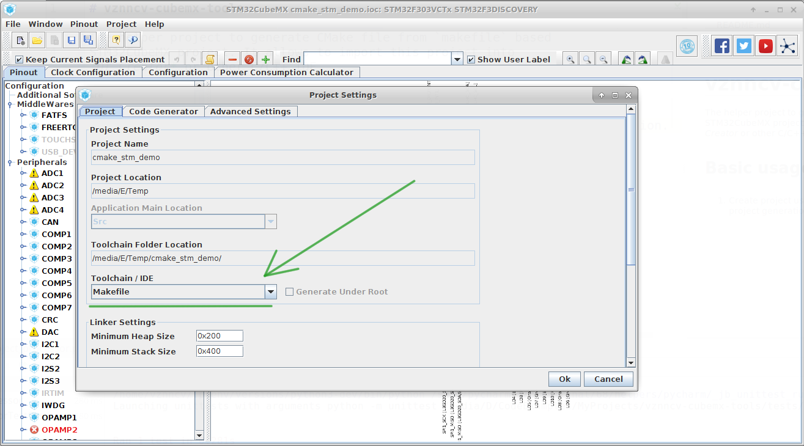

# vznncv-cubemx-tools

The helper project to generate CMake file from `makefile` based
STM32CubeMX project. It allows to import this project into
*Qt Creator* or other C/C++ IDE.

## Installation

The project requires python 3.6. You can install it from pypi:

```
pip install vznncv-cubemx-tools
```

or the latest version from github:

```
pip install git+https://github.com/vznncv/vznncv-cubemx-tools
```

## Basic usage

1. Create project using *STM32CubeMX* with *makefile* based project generation.



2. Go to project folder and run the command:

```
vznncv-cubemx generate-cmake-project
```

## Additional scripts

Besides ``CMakeLists.txt`` command generates the following files:

- `penocd_stm.cfg` - openocd script. Probably you should adjust
                     it for your configuration.
- `build.sh` - helper script to build project from console.
- `upload-app.sh` - helper script to upload compiled project to microcontroller.