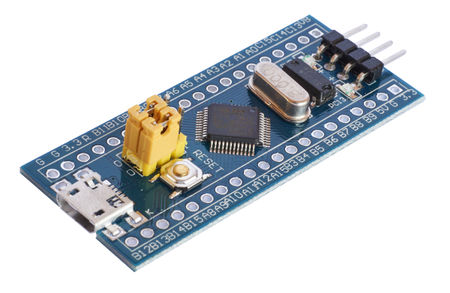
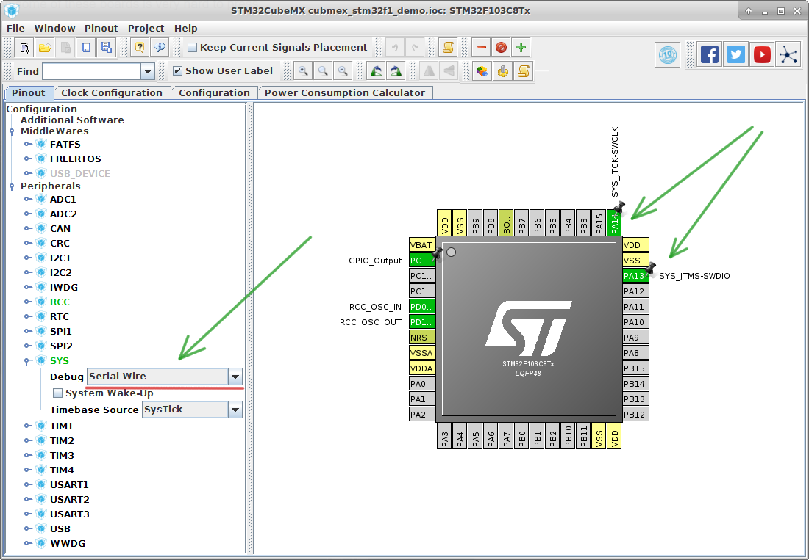

Blue pill notes
===============

If you use "Blue Pill" board:

your **OpenOCD configuration** file should have the following content::

  source [find interface/stlink-v2.cfg]

  transport select hla_swd

  source [find target/stm32f1x.cfg]

  reset_config none separate

Also don't forget enable **debug** mode in the CubeMX:

otherwise ``HAL`` library will disable pins for SWD debugger/programmer and
you will need to click reset button manually for program uploading.
